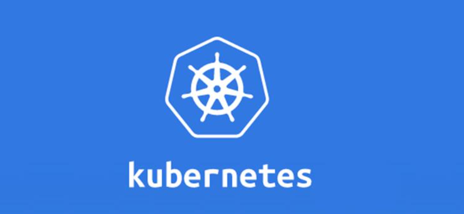

# Kubernetes

`Kubernetes` 又称作 `k8s`，是 Google 在 2014 年发布的一个开源项目。

随着云原生的快速发展，容器技术的重要性更是不言而喻，而 `Kubernetes` 是一个容器集群管理系统，是一个开源的平台，可以帮助我们快速实现容器集群的自动化部署、自动扩缩容、维护等功能。

因此，很有必要学习和掌握 `Kubernetes` 的使用。本文内容是本人在学习和实践过程的一些记录和总结，适用于 `Kubernetes` 初学者，如有错漏之处，请批评指正，共同进步！

## 目录

- [Kubernetes 入门](./docs/Kubernetes入门.md)
- [Kubernetes 部署实践](./docs/Kubernetes部署实践.md)
- [Kubernetes 核心概念与组件详解](./docs/Kubernetes核心概念与组件详解.md)
- K8S 集群搭建
    - [1-环境准备](./docs/1-环境准备.md)
    - [2-搭建简易版k8s集群](./docs/2-搭建简易版k8s集群.md)
- [Kubernetes 问题排查与记录](./docs/Kubernetes问题排查与记录.md)

## 参考
- [Kubernetes 中文社区 | 中文文档](https://www.kubernetes.org.cn/k8s)
