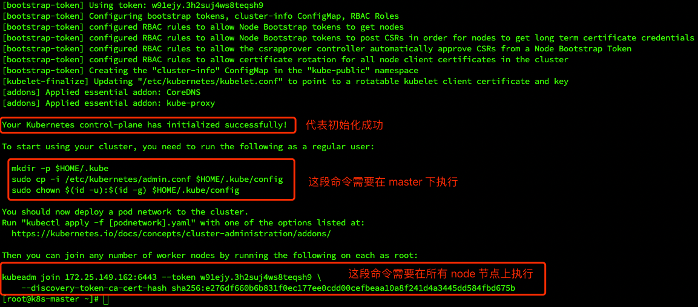
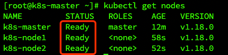
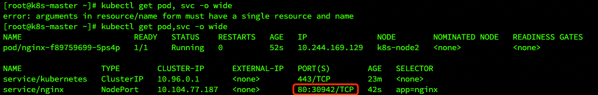

# 二、搭建 k8s 集群

## 2. 初始化集群

### 2.1 初始化 master
- 在 k8s-master 机器上执行初始化操作
  - 下面的第一个 ip 地址就是 k8s-master 机器的 ip，改成自己的机器，后面两个 ip 网段不用动。
    
```shell
kubeadm init --kubernetes-version=1.18.0  \
--apiserver-advertise-address=172.25.149.162   \
--image-repository registry.aliyuncs.com/google_containers  \
--service-cidr=10.96.0.0/12 --pod-network-cidr=10.244.0.0/16
```

执行完后结果如下图所示：



### 2.2 配置 master
- 在 k8s-master 机器上执行如下命令：
```shell
# step 1：配置使用 kubectl 命令工具（类似 docker 命令）
mkdir -p $HOME/.kube
sudo cp -i /etc/kubernetes/admin.conf $HOME/.kube/config
sudo chown $(id -u):$(id -g) $HOME/.kube/config


# step 2：查看 kubectl 是否能正常使用
kubectl get nodes

# step 3：安装 Pod 网络插件
kubectl apply -f https://docs.projectcalico.org/manifests/calico.yaml

# 如果上面这个 calico 网络插件安装不成功可以试试下面这个
# kubectl apply -f https://raw.githubusercontent.com/coreos/flannel/master/Documentation/kubeflannel.yml
```

### 2.3 node 节点加入集群
- 在所有 k8s-node 机器上执行如下命令：
```shell
# 就是初始化结果截图中第三个红框里的命令
kubeadm join 172.25.149.162:6443 --token w91ejy.3h2suj4ws8teqsh9 \
    --discovery-token-ca-cert-hash sha256:e276df660b6b831f0ec177ee0cdd00cefbeaa10a8f241d4a3445dd584fbd675b
```

### 2.4 查看节点信息
- 在 k8s-master 机器上执行查看节点命令
```shell
kubectl get nodes
```



可以看到刚刚安装的三个 k8s 节点都已经准备就绪，大功告成！

### 2.5 补充
- 如果 node 节点添加进集群失败，可以删除节点重新添加。

1. 要删除 k8s-node1 节点，首先在 master 节点上依次执行以下两个命令：
```shell
# 
kubectl drain k8s-node1 --delete-local-data --force --ignore-daemonsets
kubectl delete node k8s-node1
```

2. 执行后通过 `kubectl get node` 命令可以看到 k8s-node1 已经被成功删除。

3. 接着在 k8s-node1 节点上执行如下命令，这样该节点即完全从 k8s 集群中脱离。
```shell
kueadm reset
```

4. 之后重新在 k8s-node1 节点上执行命令加入集群即可。

## 3. 使用 k8s 部署 Nginx

- 在 k8s-master 机器上执行：
```shell
# 创建一次 deployment 部署
kubectl create deployment nginx --image=nginx
kubectl expose deployment nginx --port=80 --type=NodePort

# 查看 Nginx 的 pod 和 service 信息
kubectl get pod, svc -o wide
```



- 访问 Nginx 地址：`http://任意节点的 ip:上图中 Nginx 的对外映射端口`
  - 比如，http://172.25.149.162:30942


