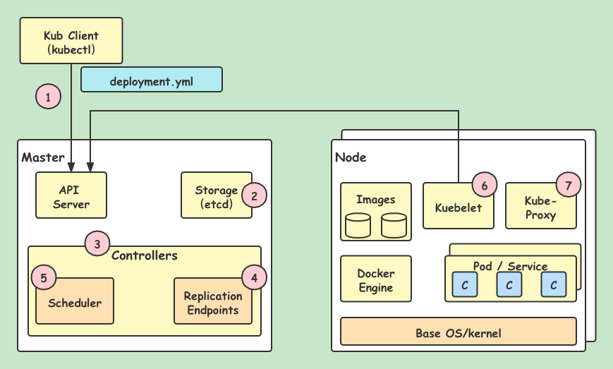

# Kubernetes 入门

## 容器

- 什么是容器？
  - 一系列隔离运行的进程，提供了一种轻量级操作系统层面的虚拟化技术。
  - 每个容器都有自己的 PID、Users、UTS、Network 栈命名空间等。
  - 与传统 VM 比具有启动快、性能损耗小、更轻量等优点。
  
- Docker 是目前使用最广，最成熟的容器技术。

- k8s 默认使用 Docker 引擎。
  - 也可以使用 `Rts`（`coreos`），或是其他遵循 `CRI`（`container runtime interface`）的容器引擎，例如 `Containerd` 等。

### 容器化系统面临的挑战

- 容器解决了应用打包、部署、运行的问题。
  - 一次构建，随处运行（Build, Ship and Run Any App, Anywhere）。
  
- 容器的挑战
  - 跨机器部署
  - 资源调度
  - 负载均衡
  - 自动伸缩
  - 容错处理
  - 服务发现
  
### 容器编排

- 容器编排（Container Orchestration）
  - 以容器为基本对象进行管理
  - 协同容器共同实现应用功能
  
- 容器编排系统主要功能
  - 容器调度（Placement，health checking...）
  - 资源管理（CPU、GPU、Memory...）
  - 服务管理（Service Discovery、Load Balance...）

## Kubernetes 概述

`Kubernetes` 又称作 `k8s`，是 Google 在2014年发布的一个开源项目。

最初 Google 开发了一个叫 `Borg` 的系统（现在命名为 `Omega`），来调度近 20 多亿个容器。 在积累了数十年的经验后，Google 决定重写这个容器管理系统，并贡献给开源社区， 而这个系统就是 `Kubernetes`。它也是 `Omega` 的开源版本。

从 2014 年第一个版本发布以来，`k8s` 迅速得到了开源社区的追捧，目前，`k8s` 已经成为了发展最快、市场占有率最高的容器编排引擎产品。

`k8s` 的目标是管理跨多个主机的容器，提供基本的部署，维护以及应用伸缩，采用 Go 语言作为主要实现语言。

`k8s` 有以下特点：
- 易学：轻量级，简单，容易理解。
- 便携：支持公有云，私有云，混合云，以及多种云平台。
- 可拓展：模块化，可插拔，支持钩子，可任意组合。
- 自修复：自动重调度，自动重启，自动复制。

在分布式系统中，部署、调度、伸缩一直是最为重要的也最为基础的功能。`Kubernetes` 就是希望解决这一序列问题的。

`Kubernetes` 目前在 [GitHub](https://github.com/kubernetes/kubernetes) 进行维护。

[Kubernetes 中文社区 | 中文文档](https://www.kubernetes.org.cn/k8s)

**Kubernetes 能够运行在任何地方！**

虽然 `Kubernetes` 最初是为 GCE 定制的，但是在后续版本中陆续增加了其他云平台的支持，以及本地数据中心的支持。

> 【**背景总结**】
> - `Kubernetes` 是 Google 开源的生产级容器编排系统，是 Google 多年大规模容器管理技术 Borg 的开源版本。
>   - 基于容器的应用部署、维护和滚动升级
>   - 负载均衡和服务发现
>   - 跨机器和跨地区的集群调度
>   - 自动伸缩
>   - 无状态服务和有状态服务
>   - 广泛的 Volume 支持
>   - 插件机制保证扩展性
> - `Kubernetes` 发展非常迅速，已经成为了容器编排领域的领导者。

## Kubernetes 架构

### k8s Cluster
  
- Master
- Worker Node（Minion）

### Master

- API Server
- Scheduler
- Controller Manager
- Dashboard(addons)

### Node

- Kubelet
  - 运行在 Node 节点上的 Agent
  - 处理 Master 节点下发到本节点的任务，管理 `Pod` 和其中的容器。
  - 定期向 Master 回报节点资源使用情况

- Kube-Proxy
  - 运行在 Node 节点上的 Agent
  - 实现 `Service` 的抽象，为一组 `Pod` 抽象的服务，`Service` 提供统一接口并提供负载均衡功能
  
- Container Runtime
  - Docker
  - Rkt

### Etcd

- CoreOS 开发并开源，基于 Raft 协议的分布式的一致性 KV 存储
- 类似于 Zookeeper
- 在 K8s 中用作分布式 KV 存储系统
- 用于保存集群所有的网络配置和对象的状态信息 

### Kubernetes 高级组件架构

### Kubernetes 调用流程

1. 用户通过 `kubectl` 来进行操作，例如部署新应用；
2. `API Server` 收到请求，并将其存储到 `Etcd` ；
3. `Watcher` 和 `Controllers` 检测到资源状态的变化，并进行操作；
4. `ReplicaSet watcher / controllers` 检测到新的 app，创建新的 `Pod` 达到期望的实例个数；
5. `Scheduler` 将新的 `Pod` 分配到 `Kubelet`；
6. `Kubelet` 检测到 `Pods`，并通过容器运行时部署他们；
7. `Kube-proxy` 管理 `Pod` 的网络，包括服务发现、负载均衡。

