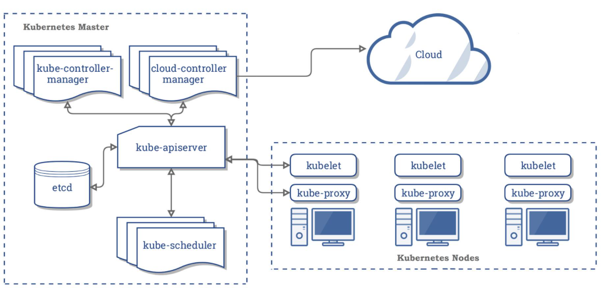
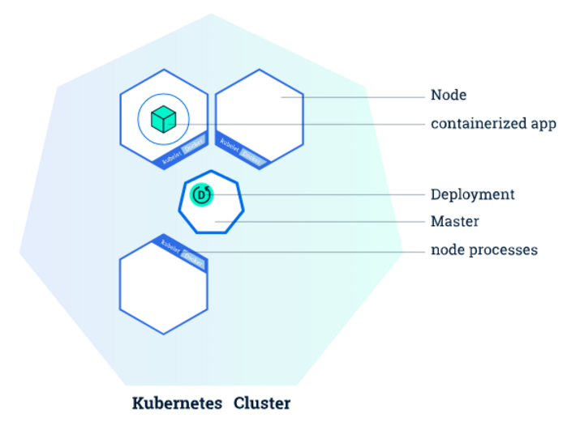
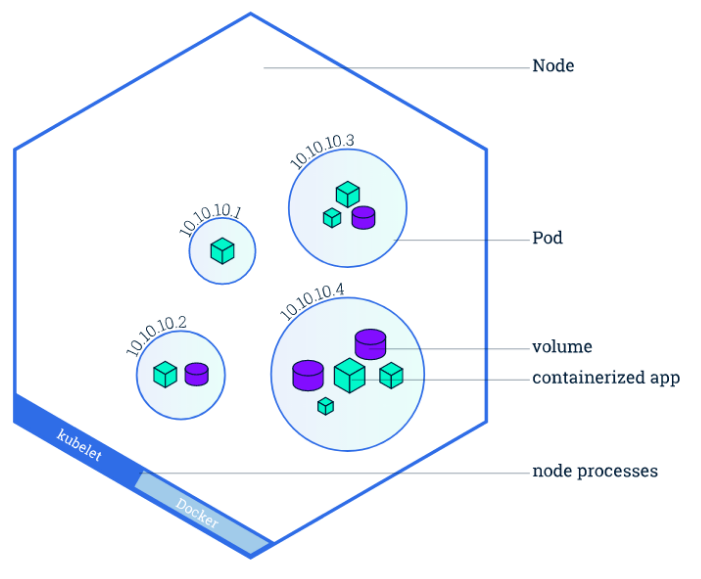
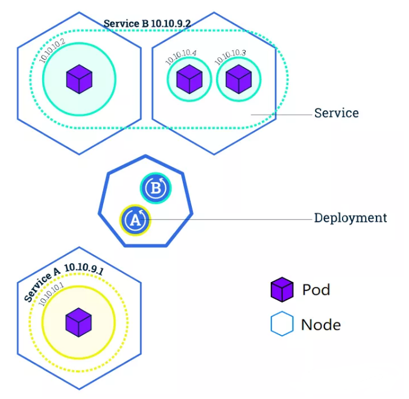
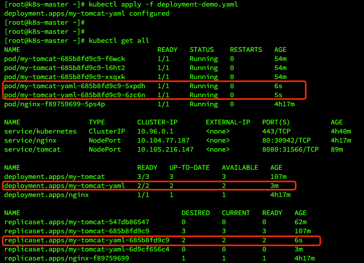
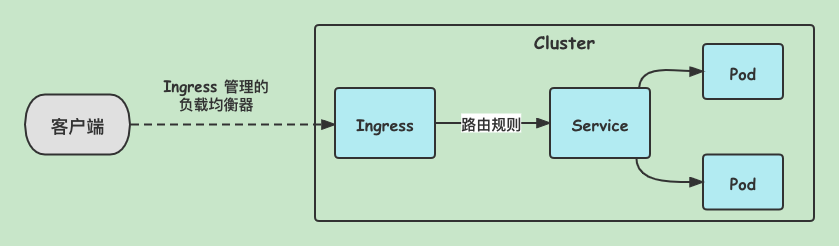
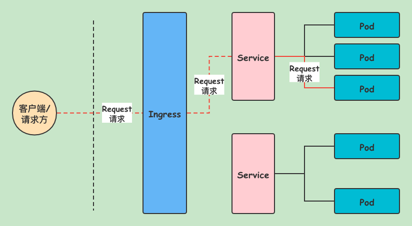

## Kubernetes 核心概念与组件详解

## K8S 核心架构原理

我们已经知道 K8S 的核心功能是：自动化运维管理多个容器化程序。

那么 K8S 怎么做到的呢？这里，我们从宏观架构上来学习 K8S 的设计思想。首先看下图：



K8S 是属于**主从设备模型（`Master-Slave` 架构）**，即由 `Master` 节点负责核心的调度、管理和运维，`Slave` 节点则执行用户的程序。
但是在 K8S 中，主节点一般被称为 `Master Node` 或者 `Head Node`，而从节点则被称为 `Worker Node` 或者 `Node`。 

> 【注意】
> 
> `Master Node` 和 `Worker Node` 是分别安装了 K8S 的 `Master` 和 `Worker` 组件的实体服务器，每个 `Node` 都对应了一台实体服务器
> （虽然 `Master Node` 可以和其中一个 `Worker Node` 安装在同一台服务器，但是建议 `Master Node` 单独部署），
> 所有 `Master Node` 和 `Worker Node` 组成了 K8S 集群，同一个集群可能存在多个 `Master Node` 和 `Worker Node`。

### Master Node

`Master Node` 包含了以下组件：
- **API Server**。**K8S 的请求入口服务**。`API Server` 负责接收 K8S 所有请求（来自 UI 界面或者 CLI 命令行工具），然后，`API Server` 根据用户的具体请求，去通知其他组件干活。
- **Scheduler**。**K8S 所有 `Worker Node` 的调度器**。当用户要部署服务时，`Scheduler` 会选择最合适的 `Worker Node`（服务器）来部署。
- **Controller Manager**。**K8S 所有 `Worker Node` 的监控器**。`Controller Manager` 有很多具体的 `Controller`，比如 `Node Controller`、`Service Controller`、`Volume Controller` 等。`Controller` 负责监控和调整在 `Worker Node` 上部署的服务的状态，比如用户要求 A 服务部署 2 个副本，那么当其中一个服务挂了的时候，`Controller` 会马上调整，让 `Scheduler` 再选择一个 `Worker Node` 重新部署服务。
- **etcd**。**K8S 的存储服务**。`etcd` 存储了 K8S 的关键配置和用户配置，K8S 中仅 `API Server` 才具备读写权限，其他组件必须通过 `API Server` 的接口才能读写数据。

### Worker Node

`Worker Node` 包含了以下组件：
- **Kubelet**。**`Worker Node` 的监视器，以及与 `Master Node` 的通讯器**。 `Kubelet` 是 `Master Node` 安插在 `Worker Node` 上的“眼线”，它会定期向 `Master Node` 汇报自己 `Node` 上运行的服务的状态，并接受来自 `Master Node` 的指示采取调整措施。负责控制所有容器的启动停止，保证节点工作正常。
- **Kube-Proxy**。**K8S 的网络代理**。`Kube-Proxy` 负责 `Node` 在 K8S 的网络通讯、以及对外部网络流量的负载均衡。
- **Container Runtime**。**`Worker Node` 的运行环境**。即安装了容器化所需的软件环境确保容器化程序能够跑起来，比如 `Docker Engine` 运行环境。

### 应用部署过程

在理解了上面几个组件的意思后，看下我们用 K8S 部署一个应用，K8S 内部各组件是如何协同工作的？
- 比如在 master 节点执行一条命令部署一个 nginx 应用（`kubectl create deployment nginx --image=nginx`）
    - 该指令首先会发到 master 节点的网关 api-server，这是 master 的唯一入口；
    - api-server 将命令请求交给 controller manager 进行处理；
    - controller manager 进行引用部署解析；
    - controller manager 会生成一次部署信息，并通过 api-server 将信息存入 etcd 存储；
    - scheduler 调度器通过 api-server 从 etcd 存储中拿到要部署的应用，开始调度看哪个节点有资源适合部署；
    - scheduler 把计算出来的调度信息通过 api-server 再放到 etcd 中；
    - 每一个 node 节点的监控组件 kubelet，随时和 master 保持联系（给 api-server 发送请求不断获取最新数据），拿到 master 节点存储在 etcd 中的部署信息；
    - 假设 node2 的 kubelet 拿到部署信息，显示自己要部署某某应用；
    - kubelet 就会 run 一个应用在当前机器上，并随时给 master 汇报当前应用的状态信息；
    - node 和 master 也是通过 master 的 api-server 组件联系的；
    - 每个机器上的 kube-proxy 能知道集群的所有网络，只要 node 访问别人或者别人访问 node，node 上的 kube-proxy 网络代理自动计算进行流量转发。

## K8S 核心概念

kubernetes 有很多核心概念，本节将挑取几个核心概念介绍。

### Deployment

`Deployment` 负责创建和更新应用程序的实例。创建 `Deployment` 后，Kubernetes Master 将应用程序实例调度到集群中的各个节点上。如果托管实例的节点关闭或被删除，`Deployment` 控制器会将该实例替换为群集中另一个节点上的实例。这提供了一种自我修复机制来解决机器故障维护问题。



### Pod 

`Pod` 相当于**逻辑主机**的概念，负责托管应用实例。包括一个或多个应用程序容器（如 `Docker`），以及这些容器的一些共享资源（共享存储、网络、运行信息等）。



### Service

`Service` 是一个抽象层，它定义了一组 `Pod` 的逻辑集，并为这些 `Pod` 支持外部流量暴露、负载均衡和服务发现。

尽管每个 `Pod` 都有一个唯一的 IP 地址，但是如果没有 `Service`，这些 IP 不会暴露在群集外部。`Service` 允许你的应用程序接收流量。`Service` 也可以用在 `ServiceSpec` 标记 `type` 的方式暴露，`type` 类型如下： 

- `ClusterIP`（默认）：在集群的内部 IP 上公开 `Service`。这种类型使得 `Service` 只能从集群内访问。 
- `NodePort`：使用 NAT 在集群中每个选定 Node 的相同端口上公开 `Service`。使用 **<NodeIP>:<NodePort>** 从集群外部访问 `Service`。是 `ClusterIP` 的超集。
- `LoadBalancer`：在当前云中创建一个外部负载均衡器（如果支持的话），并为 `Service` 分配一个固定的外部 IP。是 `NodePort` 的超集。 
- `ExternalName`：通过返回带有该名称的 CNAME 记录，使用任意名称（由 spec 中的 `externalName` 指定）公开 `Service`。不使用代理。



## K8S 中的资源

k8s 中所有的内容都抽象为资源，资源实例化之后，叫做对象，上面说的那些核心概念都是 k8s 中的资源。

### 资源类型

- 工作负载型资源（workload）：`Pod`，`ReplicaSet`，`Deployment`，`StatefulSet`，`DaemonSet` 等等。
- 服务发现及负载均衡型资源（ServiceDiscovery LoadBalance）: `Service`，`Ingress` 等等。
- 配置与存储型资源：`Volume`（存储卷），`CSI`（容器存储接口，可以扩展各种各样的第三方存储卷）。
- 特殊类型的存储卷：`ConfigMap`（当配置中心来使用的资源类型），`Secret`（保存敏感数据），`DownwardAPI`（把外部环境中的信息输出给容器
  
以上这些资源都是配置在名称空间级别。 

- 集群级资源：`Namespace`，`Node`，`Role`，`ClusterRole`，`RoleBinding`（角色绑定），`ClusterRoleBinding`（集群角色绑定）。
- 元数据型资源：`HPA`（Pod 水平扩展），`PodTemplate`（Pod 模板，用于让控制器创建 Pod 时使用的模板），`LimitRange`（用来定义硬件资源限制的）。

### 资源清单

之前我们直接用命令创建 `deployment`、`pod`、`service` 这些资源，其实在 k8s 中，**我们一般都会使用 `yaml` 格式的文件来创建符合我们预期期望的资源**，这样的 `yaml` 文件我们一般称为**资源清单**。

#### 资源清单 yaml 的格式

```yaml
apiVersion: group/apiversion # 如果没有给定 group 名称，那么默认为 croe，可以使用 kubectl api‐versions 获取当前 k8s 版本上所有的 apiVersion 版本信息（每个版本可能不同）
kind: # 资源类别
metadata: # 资源元数据 
  name
  namespace # k8s 自身的 namespace 
  lables
  annotations # 主要目的是方便用户阅读查找 
spec: # 期望的状态（desired state） 
status: # 当前状态，本字段由 kubernetes 自身维护，用户不能去定义

# 配置清单主要有 5 个一级字段，其中 status 字段用户不能定义，由 k8s 自身维护
```

### 资源清单 yaml 的使用

#### 用 yaml 创建 deployment 资源对象

- 我们可以用创建 deployment 的命令加上参数 `--dry-run -o yaml` 就可以输出这次部署的资源清单 yaml
```shell
kubectl create deployment my-tomcat --image=tomcat:7.0.75-alpine --dry-run -o yaml


[root@k8s-master ~]# kubectl create deployment my-tomcat --image=tomcat:7.0.75‐alpine --dry-run -o yaml
W0105 16:52:00.930352   23506 helpers.go:535] --dry-run is deprecated and can be replaced with --dry-run=client.
apiVersion: apps/v1
kind: Deployment
metadata:
  creationTimestamp: null
  labels:
    app: my-tomcat
  name: my-tomcat
spec:
  replicas: 1
  selector:
    matchLabels:
      app: my-tomcat
  strategy: {}
  template:
    metadata:
      creationTimestamp: null
      labels:
        app: my-tomcat
    spec:
      containers:
        - image: tomcat:7.0.75‐alpine
          name: tomcat
          resources: {}
status: {}
```

- 我们可以对上面的 yaml 适当修改保存为文件 `deployment-demo.yaml`
```yaml
apiVersion: apps/v1
kind: Deployment
metadata:
  creationTimestamp: null
  labels:
    app: my-tomcat
  name: my-tomcat-yaml # 修改 deployment 的名称
spec:
  replicas: 2 # 修改 pod 副本为两个
  selector:
    matchLabels:
      app: my-tomcat
  strategy: {}
  template:
    metadata:
      creationTimestamp: null
      labels:
        app: my-tomcat
    spec:
      containers:
      - image: tomcat:7.0.75‐alpine
        name: tomcat
        resources: {}
status: {}
```

- 然后执行如下命令就可以使用 yaml 来创建这个部署
```shell
kubectl apply -f deployment-demo.yaml
```



从上图可以看出我们使用 `yaml` 生成的部署已经成功。

#### 用 yaml 创建 service 资源对象

```shell
kubectl expose deployment my-tomcat --name=tomcat --port=8080 --type=NodePort --dry-run -o yaml


[root@k8s-master ~]# kubectl expose deployment my-tomcat --name=tomcat --port=8080 --type=NodePort --dry-run -o yaml
W0105 17:03:10.702450    2414 helpers.go:535] --dry-run is deprecated and can be replaced with --dry-run=client.
apiVersion: v1
kind: Service
metadata:
  creationTimestamp: null
  labels:
    app: my-tomcat
  name: tomcat
spec:
  ports:
  - port: 8080
    protocol: TCP
    targetPort: 8080
  selector:
    app: my-tomcat
  type: NodePort
status:
  loadBalancer: {}
```

- 同样做适当修改，保存为文件：`service-demo.yaml`
```yaml
apiVersion: v1
kind: Service
metadata:
  creationTimestamp: null
  labels:
    app: my-tomcat
  name: tomcat-service-yaml # 修改 service 名称
spec:
  ports:
  - port: 80 # service 的虚拟 ip 对应的端口，在集群内网机器可以访问用 service 的虚拟 ip 加该端口号访问服务
    protocol: TCP
    targetPort: 8080 # pod 暴露的端口，一般与 pod 内部暴露的端口一致
  selector:
    app: my-tomcat
  type: NodePort
status:
  loadBalancer: {}
```

- 然后执行如下命令就可以使用 yaml 文件创建 service
```shell
kubectl apply -f service-demo.yaml
```

#### 针对已有资源输出资源清单 yaml

- 查看 pod 资源列表
```shell
kubectl get pod
```

- 将资源的配置以 yaml 的格式输出
```shell
# 使用 -o 参数加 yaml，可以将资源的配置以 yaml 格式输出，可以使用 json，输出为 json 格式
kubectl get pod nginx-f89759699-5ps4p -o yaml
```

## K8S 高级特性

K8S 中还有一些高级特性有必要学习下，比如**弹性扩缩应用**（见上文）、**滚动更新**（见上文）、**配置管理**、**存储卷**、**网关路由**等。

在学习这些高级特性之前有必要再看几个 K8S 的核心概念。

### ReplicaSet

`ReplicaSet` 确保任何时间都有指定数量的 Pod 副本在运行。通常用来保证给定数量的、完全相同的 Pod 的可用性。建议使用 `Deployment` 来管理 `ReplicaSet`，而不是直接使用 `ReplicaSet`。

### ConfigMap

`ConfigMap` 是一种 API 对象，用来将非机密性的数据保存到键值对中。使用时，Pod 可以将其用作环境变量、命令行参数或者存储卷中的配置文件。使用 `ConfigMap` 可以将你的配置数据和应用程序代码分开。

### Volume

`Volume` 指的是存储卷，包含可被 Pod 中容器访问的数据目录。容器中的文件在磁盘上是临时存放的，当容器崩溃时文件会丢失，同时无法在多个 Pod 中共享文件，通过使用存储卷可以解决这两个问题。

常用的存储卷有如下几种：
- **configMap**：`configMap` 卷提供了向 Pod 注入配置数据的方法。`ConfigMap` 对象中存储的数据可以被 `configMap` 类型的卷引用，然后被 Pod 中运行的容器化应用使用。
- **emptyDir**：`emptyDir` 卷可用于存储缓存数据。当 Pod 分派到某个 Node 上时，`emptyDir` 卷会被创建，并且 Pod 在该节点上运行期间，卷一直存在。当 Pod 被从节点上删除时 `emptyDir` 卷中的数据也会被永久删除。
- **hostPath**：`hostPath` 卷能将主机节点文件系统上的文件或目录挂载到 Pod 中。在 Minikube 中的主机指的是 Minikube 所在虚拟机。
- **local**：`local` 卷所代表的是某个被挂载的本地存储设备，例如磁盘、分区或者目录。`local` 卷只能用作静态创建的持久卷，尚不支持动态配置。
- **nfs**：`nfs` 卷能将 NFS（网络文件系统）挂载到你的 Pod 中。
- **persistentVolumeClaim**：`persistentVolumeClaim` 卷用来将持久卷（`PersistentVolume`）挂载到 Pod 中。持久卷（PV）是集群中的一块存储，可以由管理员事先提供，或者使用存储类（`Storage Class`）来动态供应，持久卷是集群资源，类似于节点。

### Ingress

通过 K8S 的 `Ingress` 资源可以实现类似 Nginx 的基于域名访问，从而实现 Pod 的负载均衡访问。




### 高级特性

#### 配置管理

`ConfigMap` 允许你将配置文件与镜像文件分离，以使容器化的应用程序具有可移植性。接下来我们演示下如何将 `ConfigMap` 的属性注入到 Pod 的环境变量中去。

- 添加配置文件 `nginx-config.yaml` 用于创建 ConfigMap，ConfigMap 命名为 `nginx-config`，配置信息存放在 data 节点下：
```yaml
apiVersion: v1
kind: ConfigMap
metadata:
  name: nginx-config
  namespace: default
data:
  nginx-env: test
```

- 应用 `nginx-config.yaml` 文件创建 ConfigMap
```shell
kubectl create -f nginx-config.yaml
```

- 获取所有 ConfigMap
```shell
kubectl get configmap
```

- 通过 yaml 格式查看 ConfigMap 中的内容
```shell
kubectl get configmaps nginx-config -0 yaml
```

- 添加配置文件 `nginx-deployment.yaml` 用于创建 Deployment，部署一个 Nginx 服务，在 Nginx 的环境变量中引用 ConfigMap 中的属性
```yaml
apiVersion: apps/v1
kind: Deployment
metadata:
  name: nginx-deployment
  labels:
    app: nginx
spec:
  replicas: 1
  selector:
    matchLabels:
      app: nginx
  template:
    metadata:
      labels:
        app: nginx
    spec:
      containers:
      - name: nginx
        image: nginx:1.10
        ports:
          - containerPort: 80
        env:
          - name: NGINX_ENV # 在 Nginx 中设置环境变量
          valueFrom:
            configMapKeyRef:
              name: nginx-config # 设置 ConfigMap 的名称 
              key: nginx-env # 需要取值的键
```

- 应用配置文件创建 Deployment
```shell
kubectl apply -f nginx-deployment.yaml
```

- 创建成功后查看 Pod 中的环境变量，发现 NGINX_ENV 变量已经被注入
```shell
kubectl exec deployments/nginx-deployment -- env
......
NGINX_ENV=test
```

#### 存储卷使用

通过存储卷，我们可以把外部数据挂载到容器中去，供容器中的应用访问，这样就算容器崩溃了，数据依然可以存在。

- 之前我们使用 Docker 部署 Nginx 的时候，将 Nginx 的 `html`、`logs`、`conf` 目录从外部挂载到了容器中
```shell
docker run -p 80:80 --name nginx \
  -v /mydata/nginx/html:/usr/share/nginx/html \
  -v /mydata/nginx/logs:/var/log/nginx \
  -v /mydata/nginx/conf:/etc/nginx \
  -d nginx:1.10
```

- Minikube 可以认为是一台虚拟机，我们可以用 Minikube 的 ssh 命令来访问它。
```shell
minikube ssh
```

- Minikube 中默认有一个 docker 用户，需要先重置它的密码
```shell
sudo passwd docker
```

- 在 Minikube 中创建 mydata 目录
```shell
mkdir /home/docker/mydata
```

- 需要把 Nginx 的数据目录复制到 Minikube 中去，才能实现目录的挂载，注意 docker 用户只能修改 /home/docker 目录中的文件，我们通过 `scp` 命令来复制文件
```shell
scp -r /home/macro/mydata/nginx docker@192.168.49.2:/home/docker/mydata/nginx
```

- 添加配置文件 `nginx-volume-deployment.yaml` 用于创建 Deployment
```yaml
apiVersion: apps/v1
kind: Deployment
metadata:
  name: nginx-volume-deployment
  labels:
    app: nginx
spec:
  replicas: 1
  selector:
    matchLabels:
      app: nginx
  template:
    metadata:
      labels:
        app: nginx
    spec:
      containers:
        - name: nginx
          image: nginx:1.10
          ports:
            - containerPort: 80
          volumeMounts:
            - mountPath:  /usr/share/nginx/html
              name: html‐volume
            - mountPath:  /var/log/nginx/
              name: logs‐volume
            - mountPath:  /etc/nginx/
              name: conf‐volume
      volumes:
        - name: html-volume
          hostPath: 
            path: /home/docker/mydata/nginx/html
            type: Directory
        - name: logs‐volume
          hostPath:
            path: /home/docker/mydata/nginx/logs
            type: Directory
        - name: conf‐volume
          hostPath:
            path: /home/docker/mydata/nginx/conf
            type: Directory
```

- 应用配置文件创建 Deployment
```shell
kubectl apply -f nginx-volume-deployment.yaml
```

- 添加配置文件 `nginx-service.yaml` 用于创建 Service
```yaml
apiVersion: v1
kind: Service
metadata:
  name: nginx-service
spec:
  type: NodePort
  selector:
    app: nginx
  ports:
    - name: http
      protocol: TCP
      port: 80
      targetPort: 80
      nodePort: 30080
```

- 应用配置文件创建 Service
```shell
kubectl apply -f nginx-service.yaml
```

- 查看 Service 服务访问端口
```shell
[root@k8s-master ~]# kubectl get services 
NAME              TYPE        CLUSTER-IP        EXTERNAL-IP     PORT(S)       AGE
kubernetes        ClusterIP   10.96.0.1         <none>          443/TCP       4h40m 
kubernetes-nginx  NodePort    10.106.216.187    <none>          80:30158/TCP  4h17m
nginx-service     NodePort    10.103.77.147     <none>          80:30080/TCP  7s
```

- 通过 CURL 命令可以访问 Nginx 首页信息
```shell
curl $(minikube ip):30080
```

## 总结

**Service 是 K8S 服务的核心，屏蔽了服务细节，统一对外暴露服务接口，真正做到了“微服务”**。举个例子，我们的一个服务 A，部署了 3 个备份，也就是 3 个 Pod；对于用户来说，只需要关注一个 Service 的入口就可以，而不需要操心究竟应该请求哪一个 Pod。
优势非常明显：**一方面外部用户不需要感知因为 Pod 上服务的意外崩溃、K8S 重新拉起 Pod 而造成的 IP 变更，外部用户也不需要感知因升级、变更服务带来的 Pod 替换而造成的 IP 变化，另一方面，Service 还可以做流量负载均衡**。

但是，Service 主要负责 K8S 集群**内部的网络拓扑**。那么集群外部怎么访问集群内部呢？ 这个时候就需要 Ingress 了，官方文档中的解释是： 
- Ingress 是对集群中服务的外部访问进行管理的 API 对象，典型的访问方式是 HTTP。 
- Ingress 可以提供负载均衡、SSL 终结和基于名称的虚拟托管。 
  
简单来说就是：**Ingress 是整个 K8S 集群的接入层，复杂集群内外通讯**。 

Ingress 和 Service 的网络拓扑关系图如下：

