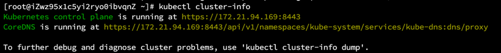
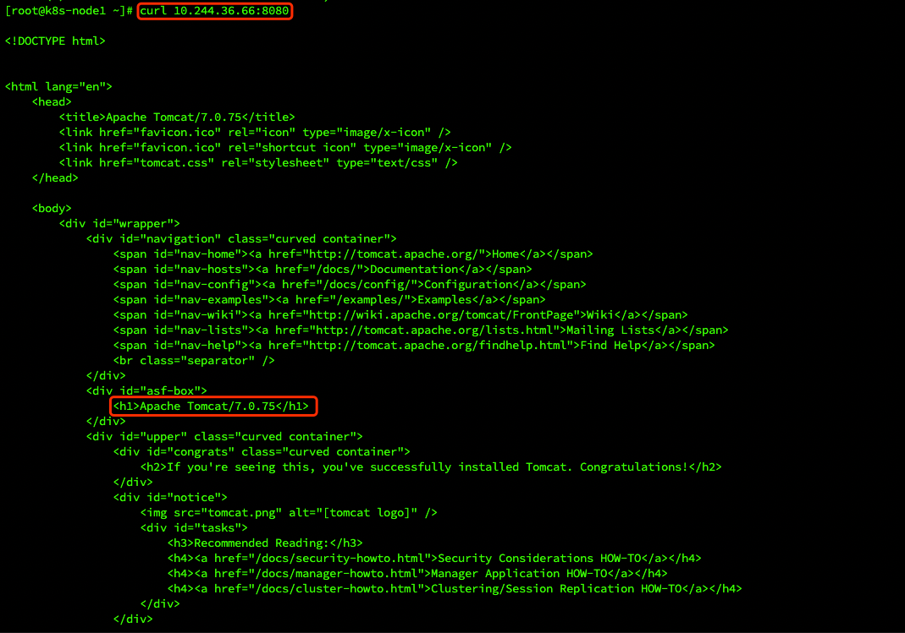
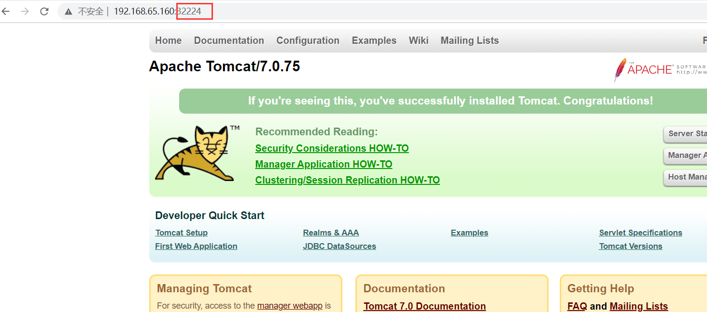
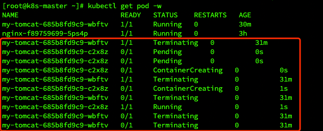
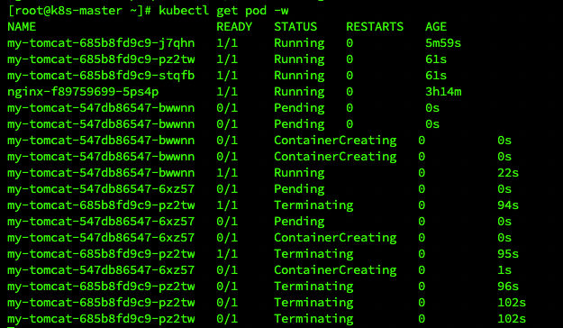
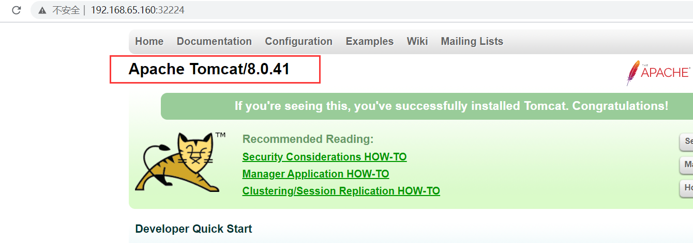
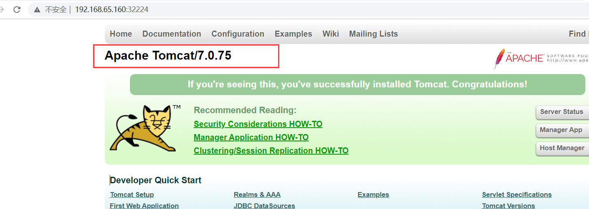
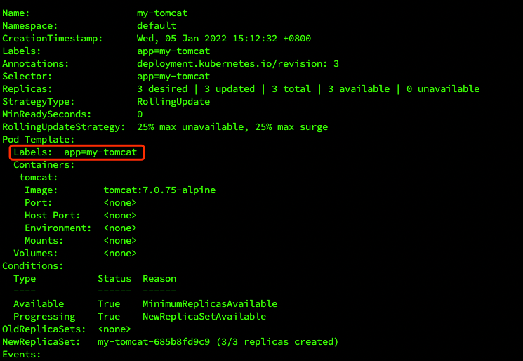

# Kubernetes 部署实践

## 安装 kubectl

kubectl 是 apiserver 的客户端工具，工作在命令行下，能够连接 apiserver 实现各种增删改查等操作。

【**注意**】

必须安装与集群中的一个次要版本差异之内的 `kubectl` 版本。例如，v1.23 版本的客户端可以与 v1.22、v1.23、v1.24 版本的控制台进行通信。
使用最新的 `kubectl` 兼容版本有助于避免一些不可预料的问题。

### 在 Linux 上安装 kubectl

在 Linux 上安装 `kubectl` 有以下办法：
- 在 Linux 上使用 `curl` 安装 `kubectl` 二进制文件
- 使用本机包管理安装
- 使用其他包管理安装

本文将介绍 `curl` 的方式安装 `kubectl` 二进制文件。

- 使用以下命令下载最新版本
```shell
curl -LO "https://dl.k8s.io/release/$(curl -L -s https://dl.k8s.io/release/stable.txt)/bin/linux/amd64/kubectl"
```

> 【笔记】
> 
> 要下载指定版本，请将 `$(curl -L -s https://dl.k8s.io/release/stable.txt)` 命令部分替换为指定版本。
> 
> 例如，要在 Linux 中下载 v1.23.0 版本，请键入：
> 
> ```shell
> curl -LO https://dl.k8s.io/release/v1.23.0/bin/linux/amd64/kubectl
> ```

- 验证二进制文件（可选步骤）
```shell
# 下载 kubectl 校验和文件：
curl -LO "https://dl.k8s.io/$(curl -L -s https://dl.k8s.io/release/stable.txt)/bin/linux/amd64/kubectl.sha256"

# 根据校验和文件验证 kubectl 二进制文件：
echo "$(<kubectl.sha256)" kubectl | sha256sum --check

# 如果有效，则输出为：
kubectl OK

# 如果检查失败 sha256 则以非零状态退出并打印类似与以下内容输出：
kubectl: FAILED
sha256sum: WARNING: 1 computed checksum did NOT match
```

> 【注意】：下载相同版本的二进制文件和校验和文件。


- 安装 `kubectl`
```shell
sudo install -o root -g root -m 0755 kubectl /usr/local/bin/kubectl
```

> 【笔记】
> 
> 如果在目标系统上没有 root 访问权限，我们可以选择将 kubectl 安装到 `~/.local/bin` 目录：
> ```shell
> chmod +x kubectl
> mkdir -p ~/.local/bin/kubectl
> mv ./kubectl ~/.local/bin/kubectl
> # and then add ~/.local/bin/kubectl to $PATH
> ```

- 检测以确保安装的版本是最新的版本：
```shell
kubectl version --client
```

- 验证 `kubectl` 配置
  
    为了让 `kubectl` 找到并访问 Kubernetes 集群，它需要一个 `kubeconfig` 文件，该文件会在我们使用 `kube-up.sh` 创建集群或成功部署 `Minikube` 集群时自动创建 。默认情况下，`kubectl` 配置位于 `~/.kube/config`。
  
    通过获取集群状态检查 `kubectl` 是否正确配置：
  
```shell
kubectl cluster-info
```

如果看到 URL 响应，则说明 `kubectl` 已正确配置为访问集群。



如果看到类似以下的消息，则 `kubectl` 未正确配置或无法连接到 Kubernetes 集群。

```shell
The connection to the server <server-name:port> was refused - did you specify the right host or port?
```

例如，如果你打算在笔记本电脑上（本地）运行 Kubernetes 集群，则需要先安装 `Minikube` 之类的工具，然后重新运行上述命令。

如果 `kubectl cluster-info` 返回 url 响应但你无法访问集群，要检查它是否配置正确，请使用：
```shell
kubectl cluster-info dump
```

### 设置镜像源

为了加快下载速度，可以设置国内的镜像源，比如阿里云镜像源：
```shell
vim /etc/yum.repos.d/kubernetes.repo 
[kubernetes] 
name=Kubernetes 
baseurl=http://mirrors.aliyun.com/kubernetes/yum/repos/kubernetes-el7-x86_64/ 
enabled=1 
gpgcheck=0
```

## 安装 minikube

`minikube` 是本地 Kubernetes，专注于让 Kubernetes 易于学习和开发。

你所需要的只是 `Docker`（或类似兼容的）容器或虚拟机环境，而 Kubernetes 只需一个命令： `minikube start`。

### 准备工作

- 2 个 CPU 或更多
- 2GB 可用内存
- 20GB 可用磁盘空间
- 网络连接
- 容器或虚拟机管理器，例如：Docker、Hyperkit、Hyper-V、KVM、Parallels、Podman、VirtualBox 或 VMware Fusion/Workstation

### 安装

- 要使用二进制下载在 x86-64 Linux 上安装最新的 `minikube` 稳定版本
```shell
curl -LO https://storage.googleapis.com/minikube/releases/latest/minikube-linux-amd64
sudo install minikube-linux-amd64 /usr/local/bin/minikube
```

### 启动集群

- 从具有管理员访问权限的终端（但未以 `root` 身份登录），运行：
```shell
minikube start
```

### 与集群交互

- 通过 `kubectl` 访问集群
```shell
kubectl get po -A 
```

- 通过 `minikube` 访问集群
```shell
minikube kubectl -- get po -A  
```

- 还可以通过将下面的指令配置到 shell 中来轻松使用
```shell
alias kubectl="minikube kubectl --"
```

- 使用 minikube 仪表盘
```shell
minikube dashboard
```

## 部署应用

本节以一个 Tomcat 应用为例，其他应用也可以根据以下步骤进行部署。

### 创建 Tomcat 应用

- 使用 `kubectl create deployment` 命令创建一个应用部署 **deployment** 与 **Pod**（容器组），Pod 里可以有多个容器。
```shell
# my-tomcat 表示 pod 的名称 --image 表示镜像的地址
kubectl create deployment my-tomcat --image=tomcat:7.0.75-alpine

[root@k8s-master ~]# kubectl create deployment my-tomcat --image=tomcat:7.0.75-alpine
deployment.apps/my-tomcat created
```

- 查看 deployment 的信息。
```shell
[root@k8s-master ~]# kubectl get deployment
NAME        READY   UP-TO-DATE   AVAILABLE   AGE
my-tomcat   1/1     1            1           55s
nginx       1/1     1            1           151m
```

- 查看 Pod 信息，`-o wide` 表示更详细的显示信息。
```shell
[root@k8s-master ~]# kubectl get pod -o wide
NAME                         READY   STATUS    RESTARTS   AGE    IP               NODE        NOMINATED NODE   READINESS GATES
my-tomcat-685b8fd9c9-wbftv   1/1     Running   0          2m8s   10.244.36.66     k8s-node1   <none>           <none>
nginx-f89759699-5ps4p        1/1     Running   0          152m   10.244.169.129   k8s-node2   <none>           <none>
```

- 查看 Pod 打印的日志
```shell
kubectl logs my-tomcat-685b8fd9c9-wbftv # pod 的名称
```

- 使用 `exec` 可以在 Pod 的容器中执行命令
```shell
# 这里使用 env 命令查看环境变量
kubectl exec my-tomcat-685b8fd9c9-wbftv -- env
```

- 进入 Pod 容器内部并执行 bash 命令
```shell
kubectl exec -it my-tomcat-685b8fd9c9-wbftv -- sh

# 如果想退出容器可以使用 exit 命令
```

#### 访问应用 pod

现在我们尝试访问一下刚刚部署的 tomcat pod

- 集群内访问（在集群里任意节点都可以访问）
```shell
curl 172.25.149.163:8080
```



- 此时，集群外部是无法访问应用的，我们需要创建一个 service 服务才能使外部客户端可以访问我们的 pod。

### 创建 service

- 创建一个 service
```shell
kubectl expose deployment my-tomcat --name=tomcat --port=8080 --type=NodePort

[root@k8s-master ~]# kubectl expose deployment my-tomcat --name=tomcat --port=8080 --type=NodePort
service/tomcat exposed
```

- 查看 service 信息，port 信息里冒号后面的端口号就是对集群外暴露的访问接口。
```shell
kubectl get svc -o wide

[root@k8s-master ~]# kubectl get svc -o wide
NAME         TYPE        CLUSTER-IP       EXTERNAL-IP   PORT(S)          AGE     SELECTOR
kubernetes   ClusterIP   10.96.0.1        <none>        443/TCP          3h12m   <none>
nginx        NodePort    10.104.77.187    <none>        80:30942/TCP     169m    app=nginx
tomcat       NodePort    10.105.216.147   <none>        8080:32224/TCP   94s     app=my-tomcat
```

#### 集群外部访问
- 使用任意节点的 ip 加上暴露的端口就可以访问

service 服务有个特点，如果端口暴露类型为 NodePort，那么可以通过集群内任意一台主机加暴露的端口进行访问。
  
### 服务自愈

- 现在我们来删除刚刚添加的 tomcat pod，看看是发生什么。
```shell
# 查看 pod 信息，-w 的意思是一直等待观察 pod 信息的变动
kubectl get pod -w

# 开启另外一个窗口执行如下命令，同时观察之前命令窗口的变化情况
kubectl delete pod my-tomcat-685b8fd9c9-wbftv
```



> 我们可以观察到之前的 tomcat pod 被销毁，但是又重新启动了一个新的 tomcat pod，这就是 K8S 的服务**自愈能力**，不需要运维人员干预。

- 查看 deployment 和 service 的状态
```shell
kubectl get deploy,svc

[root@k8s-master ~]# kubectl get deploy,svc
NAME                        READY   UP-TO-DATE   AVAILABLE   AGE
deployment.apps/my-tomcat   1/1     1            1           36m
deployment.apps/nginx       1/1     1            1           3h6m

NAME                 TYPE        CLUSTER-IP       EXTERNAL-IP   PORT(S)          AGE
service/kubernetes   ClusterIP   10.96.0.1        <none>        443/TCP          3h29m
service/nginx        NodePort    10.104.77.187    <none>        80:30942/TCP     3h6m
service/tomcat       NodePort    10.105.216.147   <none>        8080:32224/TCP   18m
```

再一次访问 service 地址，依然可以访问成功。

### 服务扩容/缩容

#### 扩容
- 对 my-tomcat 的 deployment 进行扩容
```shell
# 扩容到 3 个 pod
kubectl scale --replicas=3 deployment my-tomcat

[root@k8s-master ~]# kubectl scale --replicas=3 deployment my-tomcat
deployment.apps/my-tomcat scaled
```

- 查看 pod 信息，发现已经有 3 个 tomcat 的 pod
```shell
kubectl get pod

[root@k8s-master ~]# kubectl get pod
NAME                         READY   STATUS    RESTARTS   AGE
my-tomcat-685b8fd9c9-c2x8z   1/1     Running   0          7m32s
my-tomcat-685b8fd9c9-j7qhn   1/1     Running   0          41s
my-tomcat-685b8fd9c9-nchpd   1/1     Running   0          41s
nginx-f89759699-5ps4p        1/1     Running   0          3h9m
```

#### 缩容

- 缩容至 1 个 pod
```shell
kubectl scale --replicas=1 deployment my-tomcat
```

### 滚动升级与回滚

对 my-tomcat 的 deployment 进行滚动升级和回滚，将 tomcat 版本由 `tomcat:7.0.75-alpine` 升级到 `tomcat:8.0.41-jre8-alpine`，然后再回滚到 `tomcat:7.0.75-alpine`。

#### 滚动升级
```shell
kubectl set image deployment my-tomcat tomcat=tomcat:8.0.41-jre8-alpine
```

执行 `kubectl get pod -w` 观察 pod 的变动情况，可以看到有的 pod 在销毁，有的 pod 在创建。



- 查看 pod 信息
```shell
[root@k8s-master ~]# kubectl get pod
NAME                         READY   STATUS    RESTARTS   AGE
my-tomcat-547db86547-6xz57   1/1     Running   0          65s
my-tomcat-547db86547-bwwnn   1/1     Running   0          87s
my-tomcat-547db86547-cvmjp   1/1     Running   0          45s
nginx-f89759699-5ps4p        1/1     Running   0          3h16m
```

- 查看某个 pod 的详细信息，发现 pod 里的镜像版本已经升级了
```shell
kubectl describe pod my-tomcat-547db86547-6xz57

[root@k8s-master ~]# kubectl describe pod my-tomcat-547db86547-6xz57
Name:         my-tomcat-547db86547-6xz57
Namespace:    default
Priority:     0
Node:         k8s-node1/172.25.149.163
Start Time:   Wed, 05 Jan 2022 15:57:36 +0800
Labels:       app=my-tomcat
              pod-template-hash=547db86547
Annotations:  cni.projectcalico.org/containerID: 46c569dfd462a465d14966b7d8d7a81188b827bec7c8a9d0a651d4a71b93fd68
              cni.projectcalico.org/podIP: 10.244.36.71/32
              cni.projectcalico.org/podIPs: 10.244.36.71/32
Status:       Running
IP:           10.244.36.71
IPs:
  IP:           10.244.36.71
Controlled By:  ReplicaSet/my-tomcat-547db86547
Containers:
  tomcat:
    Container ID:   docker://80a90bba7091880c5529a1d46bcf2ecd0a230ec15dfb13272353e076b87b67a9
    Image:          tomcat:8.0.41-jre8-alpine
    Image ID:       docker-pullable://tomcat@sha256:17b2137b86c64013a03047e4c90b7dc63aebb7d1bd28641539d38ff00281ab9e
    Port:           <none>
    Host Port:      <none>
    State:          Running
      Started:      Wed, 05 Jan 2022 15:57:54 +0800
    Ready:          True
    Restart Count:  0
    Environment:    <none>
    Mounts:
      /var/run/secrets/kubernetes.io/serviceaccount from default-token-47jz2 (ro)
Conditions:
  Type              Status
  Initialized       True 
  Ready             True 
  ContainersReady   True 
  PodScheduled      True 
Volumes:
  default-token-47jz2:
    Type:        Secret (a volume populated by a Secret)
    SecretName:  default-token-47jz2
    Optional:    false
QoS Class:       BestEffort
Node-Selectors:  <none>
Tolerations:     node.kubernetes.io/not-ready:NoExecute for 300s
                 node.kubernetes.io/unreachable:NoExecute for 300s
Events:
  Type    Reason     Age    From                Message
  ----    ------     ----   ----                -------
  Normal  Scheduled  3m51s  default-scheduler   Successfully assigned default/my-tomcat-547db86547-6xz57 to k8s-node1
  Normal  Pulling    3m50s  kubelet, k8s-node1  Pulling image "tomcat:8.0.41-jre8-alpine"
  Normal  Pulled     3m34s  kubelet, k8s-node1  Successfully pulled image "tomcat:8.0.41-jre8-alpine"
  Normal  Created    3m33s  kubelet, k8s-node1  Created container tomcat
  Normal  Started    3m33s  kubelet, k8s-node1  Started container tomcat
```

- 此时访问 tomcat，也看到版本已经升级。



#### 版本回滚

- 查看历史版本
```shell
kubectl rollout history deploy my-tomcat


[root@k8s-master ~]# kubectl rollout history deploy my-tomcat
deployment.apps/my-tomcat 
REVISION  CHANGE-CAUSE
1         <none>
2         <none>
```

- 回滚到上一个版本
```shell
kubectl rollout undo deployment my-tomcat #--to-revision 参数可以指定回退的版本


[root@k8s-master ~]# kubectl rollout undo deployment my-tomcat
deployment.apps/my-tomcat rolled back
```

- 再次访问 tomcat，发现发现已经回退。



### 标签

通过给资源加 Label，可以方便地管理资源（如 Deployment、Pod、Service 等）。

- 查看 Deployment 中所包含的 Label
```shell
kubectl describe deployment my-tomcat
```



- 通过 Label 查询 Pod
```shell
kubectl get pods -l app=my-tomcat


[root@k8s-master ~]# kubectl get pods -l app=my-tomcat
NAME                         READY   STATUS    RESTARTS   AGE
my-tomcat-685b8fd9c9-f6wck   1/1     Running   0          6m18s
my-tomcat-685b8fd9c9-l6ht2   1/1     Running   0          6m15s
my-tomcat-685b8fd9c9-xxqxk   1/1     Running   0          6m19s
```

- 通过 Label 查询 Service
```shell
kubectl get services -l app=my-tomcat

[root@k8s-master ~]# kubectl get services -l app=my-tomcat
NAME     TYPE       CLUSTER-IP       EXTERNAL-IP   PORT(S)          AGE
tomcat   NodePort   10.105.216.147   <none>        8080:31566/TCP   41m
```

- 给 Pod 添加 Label
```shell
kubectl label pod my-tomcat-685b8fd9c9-f6wck version=v1

[root@k8s-master ~]# kubectl label pod my-tomcat-685b8fd9c9-f6wck version=v1
pod/my-tomcat-685b8fd9c9-f6wck labeled
```

- 查看 Pod 的详细信息，可以查看到 Label 信息
```shell
kubectl describe pods my-tomcat-685b8fd9c9-f6wck


[root@k8s-master ~]# kubectl describe pods my-tomcat-685b8fd9c9-f6wck
Name:         my-tomcat-685b8fd9c9-f6wck
Namespace:    default
Priority:     0
Node:         k8s-node1/172.25.149.163
Start Time:   Wed, 05 Jan 2022 16:05:19 +0800
Labels:       app=my-tomcat
              pod-template-hash=685b8fd9c9
              version=v1
Annotations:  cni.projectcalico.org/containerID: 8155f5ce70b75c6d0d6b0b1b3e8752ee111bfafaf2fe13dc68c1637adee4fedc
              cni.projectcalico.org/podIP: 10.244.36.73/32
              cni.projectcalico.org/podIPs: 10.244.36.73/32
Status:       Running
IP:           10.244.36.73
......
```

- 通过 Label 查询 Pod
```shell
kubectl get pods -l version=v1

[root@k8s-master ~]# kubectl get pods -l version=v1
NAME                         READY   STATUS    RESTARTS   AGE
my-tomcat-685b8fd9c9-f6wck   1/1     Running   0          10m
```

- 通过 Label 删除服务
```shell
kubectl delete service -l app=test-service
```

### 小总结
 
> - `kubectl create deployment` # 创建一个 deployment 来管理创建的容器。
> - `kubectl get` # 显示一个或多个资源，可以使用标签过滤，默认查看当前名称空间的资源。
> - `kubectl expose` # 将一个资源暴露为一个新的 kubernetes service资源，资源包括 `pod(po)`、`service(svc)`、`replicationcontroller(rc)`、`deployment(deploy)`、`replicaset(rs)`。
> - `kubectl describe` # 显示特定资源或资源组的详细信息。
> - `kubectl scale` # 可以对 Deployment、ReplicaSet、Replication Controller 或者 StatefulSet 设置新的值，可以指定一个或多个先决条件。
> - `kubectl set` # 更改现有的应用程序资源。
> - `kubectl rollout` # 资源回滚管理。

以上是 kubectl 命令行下的一些简单操作，更多命令可以参考 [官方文档](https://kubernetes.io/zh/docs/reference/kubectl/overview/) 。